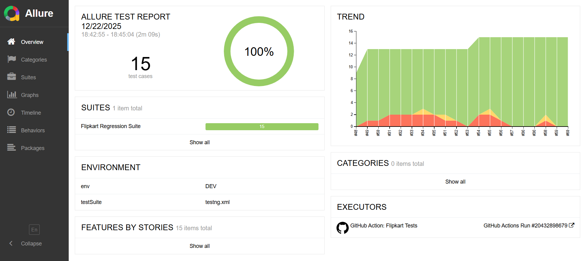
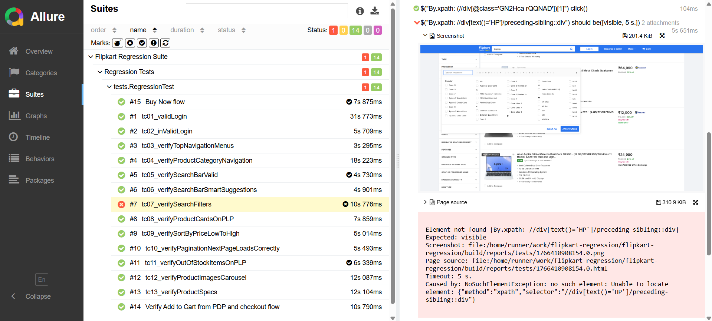
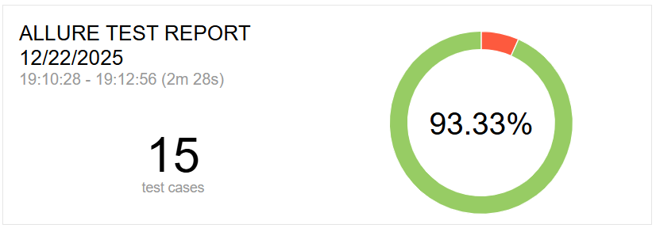
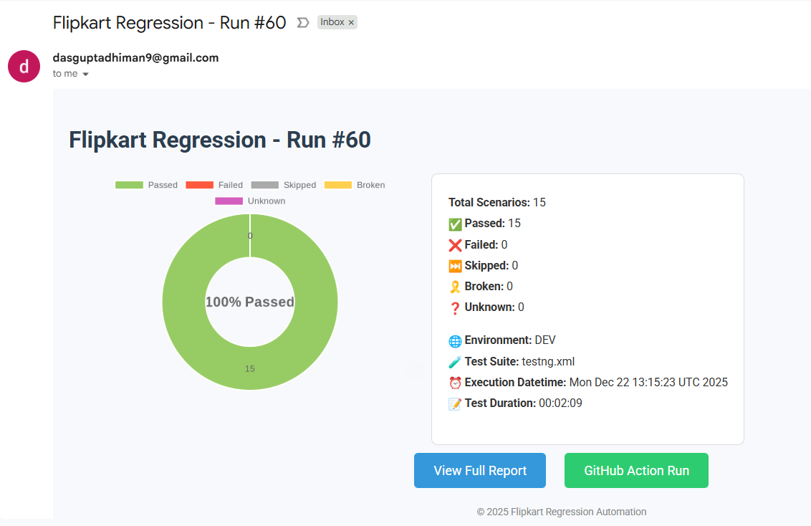
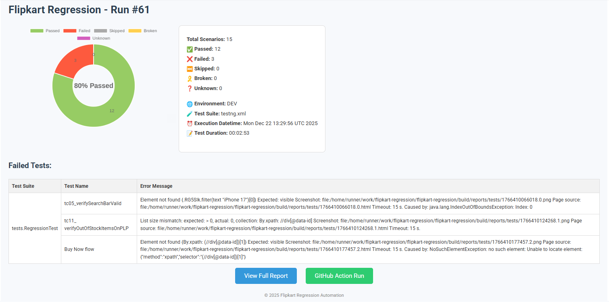

# 🛒 Flipkart End-to-End Automation Testing Framework


## 📌 Project Overview

This repository contains a **scalable, CI/CD-ready end-to-end test automation framework** built for the **Flipkart e-commerce web platform**.

The framework automates critical user journeys such as:
- **Product search**
- **Product details validation (PDP)**
- **Image carousel & zoom**
- **Add to cart**
- **Checkout flow validation**
- **Login / Address / Payment screen verification**

The project is designed to mirror real-world SDET practices, making it suitable for:
- **Enterprise regression testing**
- **CI/CD pipelines**

## 🎯 Key Highlights

**✅ Page Object Model (POM)**<br>
**✅ Selenide-based stable UI automation**<br>
**✅ TestNG test orchestration**<br>
**✅ Allure rich reporting with screenshots**<br>
**✅ GitHub Actions CI/CD integration**<br>
**✅ Email notifications with execution summary**<br>
**✅ Headless & local execution support**<br>
**✅ Failure screenshots attached to reports**<br>

## 🧱 Tech Stack

| **Layer**       | **Technology**      |
|-----------------|---------------------|
| Language        | Java 17             |
| UI Automation   | Selenium + Selenide |
| Test Framework  | TestNG              |
| Build Tool      | Maven               |
| Reporting       | Allure              |
| CI/CD           | GitHub Actions      |
| Version Control | GitHub              |


## 🗂️ Project Structure

```
flipkart-automation/
│
├── .github/
│   └── workflows/
│       └── flipkart-regression.yml      # GitHub Actions CI/CD pipeline
│
├── src/
│   ├── main/
│   │   └── java/
│   │       └── config/
│   │           └── ConfigReader.java    # Environment/config reader
│   │
│   └── test/
│       ├── java/
│       │   ├── base/
│       │   │   ├── BaseTest.java         # Browser & test setup
│       │   │   └── TestListener.java     # TestNG + Allure listener
│       │   │
│       │   ├── pages/
│       │   │   ├── HomePage.java
│       │   │   ├── SearchResultsPage.java
│       │   │   ├── ProductDetailsPage.java
│       │   │   ├── CartPage.java
│       │   │   └── CheckoutPage.java
│       │   │
│       │   ├── tests/
│       │   │   ├── SearchTest.java
│       │   │   ├── ProductDetailsTest.java
│       │   │   ├── AddToCartTest.java
│       │   │   └── CheckoutTest.java
│       │   │
│       │   ├── utils/
│       │   │   ├── BrowserUtils.java     # Window/tab handling
│       │   │   ├── ScreenshotUtil.java   # Failure screenshots
│       │   │   ├── EmailUtil.java        # CI email notifications
│       │   │   └── AllureUtil.java       # Allure attachments
│       │   │
│       │   └── constants/
│       │       └── AppConstants.java     # URLs, timeouts, messages
│       │
│       └── resources/
│           ├── testng.xml                # Test suite config
│           ├── allure.properties         # Allure configuration
│           ├── log4j2.xml                # Logging configuration
│           └── config.properties         # Env-specific values
│
├── reports/
│   └── allure-results/                  # Generated during execution
│
├── screenshots/
│   └── failures/                        # Screenshots on failure
│
├── pom.xml                              # Maven dependencies
├── README.md                            # Project documentation
└── .gitignore
```

## 🧪 Automated Test Scenarios Covered

### 🔹 Product Discovery
- Search product from homepage
- Validate search results
- Open product details page (PDP)

### 🔹 Product Details Page (PDP)
- Verify product title & price
- Validate image carousel
- Hover-based image zoom (environment aware)

### 🔹 Cart & Checkout
- Add product to cart
- Verify correct product & price in cart
- Validate “Place Order” CTA
- Verify checkout screens:
  - Login / Signup
  - Delivery Address
  - Order Summary
  - Payment Options

## 📊 Allure Reporting

The framework integrates **Allure Reports** to provide:
- Test execution summary
- Step-wise execution logs
- Screenshots on failure
- Pie chart visualization of results

### 📌 Sample Allure Dashboard



### 📌 Failure Screenshot Attachment

(Attached automatically when a test fails)

### 📈 Test Result Visualization
The CI pipeline generates pictorial test result representation in the form of a Pie Chart, and also includes:

- Pass / Fail / Skip ratio
- Execution trends
- Failure screenshots embedded in Allure

### 📌 Pie Chart Example



## 🔁 CI/CD Pipeline (GitHub Actions)

This project is fully CI/CD enabled using GitHub Actions.

### 🔹 Pipeline Capabilities

Triggered on:

- Manual workflow dispatch
- Scheduled cron runs
- Executes tests in headless mode
- Generates Allure reports
- Sends email notifications with execution details

### 📌 Workflow Diagram
```
Code Push / Schedule
        ↓
GitHub Actions Runner
        ↓
Run TestNG Suite
        ↓
Generate Allure Report
        ↓
Email Notification
```

### 📧 Email Notification (CI Execution)

After execution, an automated email is sent containing:
- Execution status
- Total / Passed / Failed tests
- Allure report link
- GitHub action link
- Error messages for failed testcases

### 📌 Sample Email Screenshot



### 📌 Sample Error Messages for Failed Testcases



## 🏃 How to Run Tests Locally

### Prerequisites
- Java 17+
- Maven
- Chrome browser 

### Run all tests
```
mvn clean test
```

### Generate Allure report
```
allure serve target/allure-results
```

### ⚙️ Environment Handling

* The framework intelligently handles:
* Local execution (full UI features)
* CI execution (headless limitations)
* Hover-based features (like image zoom) are environment-aware to avoid false CI failures.

### 🧠 Design Decisions & Best Practices

* Selenide chosen for stability and auto-waits
* Conditional UI validation to support headless CI
* Page Object Model for maintainability
* Non-flaky assertions for real-world reliability
* Failure screenshots for faster debugging

### 🚀 Future Enhancements

* Cross-browser execution
* Parallel test execution
* Dockerized test runs
* API + UI hybrid flows
* Test data externalization

### 👤 Author

**Sourav raj<br>
SDET | Automation Engineer**

🔗 GitHub: https://github.com/souravrajthakur/Selenium_flipkart<br>
🔗 LinkedIn: https://www.linkedin.com/in/souravrajthakur/
<

### ⭐ Why This Project Stands Out

This framework is built not just to pass tests, but to demonstrate real **SDET engineering practices, CI/CD maturity, and production-grade automation design**.
